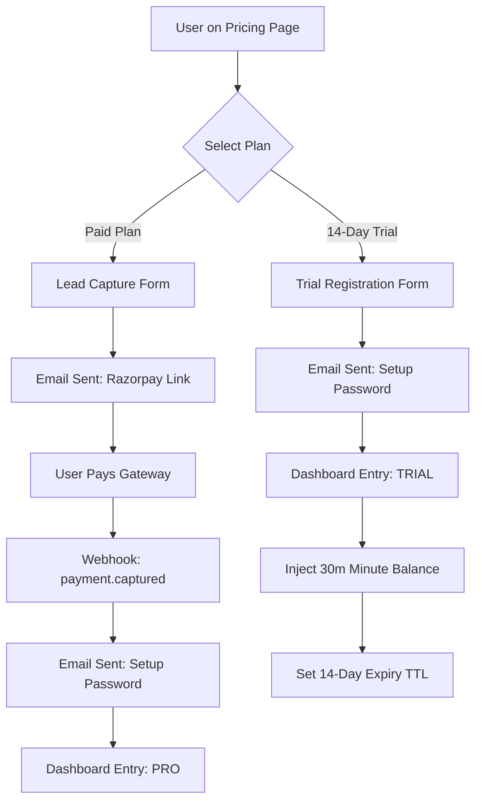

# 01 | User Onboarding & Identity
**Subject**: Path-Based Authentication, Trial Activation, and Identity Provisioning  
**Version**: 1.2.0  

---

## 📑 Table of Contents
1. [Flow Overview: The Two Onboarding Architectures](#flow-overview-the-two-onboarding-architectures)
2. [Workflow A: Paid Subscription Path (Payment-First)](#workflow-a-paid-subscription-path-payment-first)
3. [Workflow B: Trial Account Path (14-Day Activation)](#workflow-b-trial-account-path-14-day-activation)
4. [Step 3: Identity Finalization (The Password Loop)](#step-3-identity-finalization-the-password-loop)
5. [Step 4: Automatic Entitlement Provisioning](#step-4-automatic-entitlement-provisioning)
6. [Security & Abuse Prevention](#security--abuse-prevention)

---

## 1. Flow Overview: The Two Onboarding Architectures
The platform supports two distinct entry points for new tenants. The system branches the onboarding logic based on whether the user selects a "Premium Plan" or a "14-Day Trial." This logic is orchestrated by the `EmailService` and the `AuthRouter`.

### 1.1 Architecture Diagram

---

## 2. Workflow A: Paid Subscription Path (Payment-First)

Used for high-intent professional and enterprise users.

1.  **Lead Capture**: User enters Name/Email on the pricing page.
2.  **Payment Link Dispatch**: The system sends a transactional email containing a unique **Razorpay Payment Link**.
3.  **Gateway interaction**: The user completes the payment via the Razorpay checkout.
4.  **Verification**: Upon successful `payment.captured` webhook, the system issues a **Password Setup Token**.

---

## 3. Workflow B: Trial Account Path (14-Day Activation)

Used for users exploring the platform features before financial commitment.

1.  **Direct Registration**: User enters Name/Email on the "Start Free Trial" form. No payment details are requested.
2.  **Bypassing the Gateway**: The system ignores the payment webhook requirement and immediately triggers the **Identity Email**.
3.  **Password Setup Link**: The system sends an email containing a secure URL to `/setup-password?token=XYZ`.
4.  **Implicit Entitlement**: Unlike the paid path, the trial user gains access to a time-limited minute balance (e.g., 30 minutes) valid for exactly 14 days.

---

## 4. Step 3: Identity Finalization (The Password Loop)

Regardless of the path (Paid or Trial), identity creation is centralized in this stage.

### 4.1 The Password Setup Interface
1.  **Handshake**: The user clicks the link in their email. The dashboard validates the `setup_token` against the backend.
2.  **Input**: The user defines their password.
3.  **Bcrypt Commitment**: The backend hashes the password using **Bcrypt**.
4.  **Status Transition**: The user record is toggled from `UNINITIALIZED` to `ACTIVE`.

---

## 5. Step 4: Automatic Entitlement Provisioning

### 5.1 Trial-Specific Logic
For Workflow B users, the system executes a specialized lifecycle task:
-   **Allocation**: Injects "Trial Minutes" (e.g., 1800 seconds) into the `UserMinuteBalance`.
-   **TTL Logic**: Sets a `trial_expiry_at` timestamp exactly **14 days** from the current `now()`.
-   **Restriction**: Trial accounts are flagged to prevent certain high-cost features (e.g., unlimited agent concurrency) and are subject to balance erasure upon upgrade (BR-201).

### 5.2 Seamless Entry
Upon setting the password, the system issues a JWT and redirects the user to the Dashboard. The Minute Balance reflects either the **Purchased Plan** (Workflow A) or the **14-Day Trial** (Workflow B).

---

## 6. Security & Abuse Prevention

### 6.1 Multi-Registration Control
-   **Email Fingerprinting**: To prevent "Trial Looping," the system blocks registration from emails that have previously utilized a 14-day trial.
-   **Domain Blacklisting**: Provisional or "throwaway" email domains are rejected at the registration layer.

### 6.2 Token Expiry
All onboarding links (Payment links and Password links) carry a strict **2-hour TTL**. If a user does not finalize their identity within this window, the lead is considered "stale" and the token is revoked.

---
**END OF SECTION 01**
