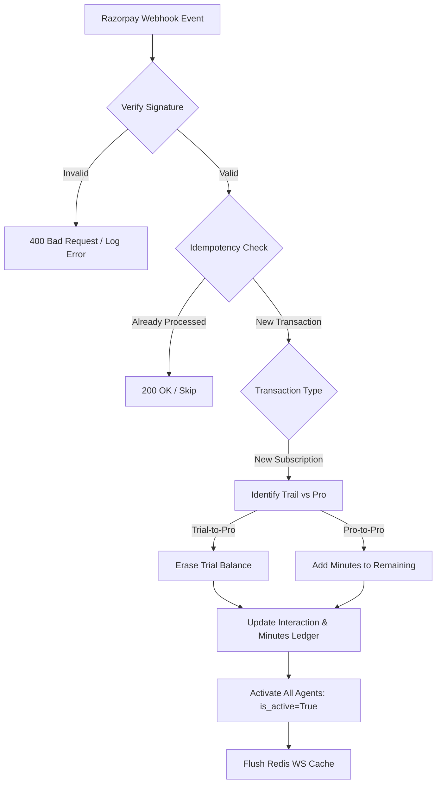

# 02 | Subscription & Credit Provisioning
**Subject**: Financial Orchestration, Webhook Processing, and Entitlement Scaling  
**Version**: 1.0.0  

---

## 📑 Table of Contents
1. [Flow Overview](#flow-overview)
2. [Phase 1: Plan Selection & Order Initiation](#phase-1-plan-selection--order-initiation)
3. [Phase 2: The Gateway Handshake (Razorpay)](#phase-2-the-gateway-handshake-razorpay)
4. [Phase 3: Webhook Orchestration & Reconciliation](#phase-3-webhook-orchestration--reconciliation)
5. [Phase 4: Global Entitlement Propagation](#phase-4-global-entitlement-propagation)

---

## 1. Flow Overview
The Subscription flow is the financial heartbeat of the platform. It manages the conversion of currency into "AI Provisioned Time" (Minutes). This flow bridges the frontend payment interface, the external payment gateway, and the internal usage ledger.

---

## 2. Phase 1: Plan Selection & Order Initiation

### 2.1 Technical Handshake
1.  **Selection**: The user selects a Plan (e.g., "Pro - 350 Minutes") from the `/plans` page in the React dashboard.
2.  **Verification**: The dashboard calls `GET /api/plans/{id}` to verify the latest pricing and minute allocation.
3.  **Provisioning Intent**: The backend creates a `PaymentIntent` record to track the pending transaction locally before redirecting to the gateway.

---

## 3. Phase 2: The Gateway Handshake (Razorpay)

The platform utilizes Razorpay as the primary payment processor.
1.  **The Checkout Overlay**: The frontend invokes the Razorpay JS library, passing the `amount` and `currency` defined in the Plan model.
2.  **The External Loop**: The user interacts directly with Razorpay’s secure environment to complete the payment.
3.  **Local Sync**: Razorpay returns a `payment_id` and a `signature` to the frontend, which is then verified by the backend to ensure the client hasn't tampered with the transaction amount.

### 4.1 Reconciliation Flowchart

### 4.2 Webhook Processing Pipeline
1.  **Ingress**: The `POST /api/webhooks/razorpay` endpoint receives the notification.
2.  **Signature Verification**: The backend uses the `razorpay` Python library to verify the HMAC-SHA256 signature against the `WEBHOOK_SECRET`.
3.  **Idempotency Check**: Before processing, the system checks if the `payment_id` has already been credited to prevent "Double Minting" of minutes.
4.  **Balance Adjustment (Business Rule BR-201 & BR-202)**: The `PaymentService` initiates a multi-row database transaction:
    -   *Update 1*: Log the successful payment in the `Transactions` table.
    -   *Update 2*: Calculate the seconds to add (Minutes * 60).
    -   *Logic Check*: 
        -   If User's current plan is `TRIAL`: Set `remaining_seconds` directly to the new plan allocation (Old trial balance is erased).
        -   If User's current plan is `PRO`: Increment `remaining_seconds` by the new allocation (Balance is additive).
    -   *Update 3*: Increment `UserMinuteBalance.total_seconds` and update `UserMinuteBalance.remaining_seconds` based on the logic above.

---

## 5. Phase 4: Global Entitlement Propagation

### 5.1 Real-time Activation
If the user was previously suspended due to a zero balance, the payment trigger initiates a **Resurrection Cycle**:
1.  **Agent Awakening**: All agents for the `user_id` are set back to `is_active = True`.
2.  **Cache Invalidation**: A message is published to the Redis bus (or internal cache) to notify the WebSocket Proxy that this user is now authorized for new connections.

---
**END OF SECTION 02**
