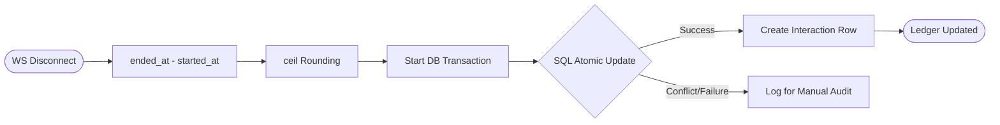

# 05 | Usage Ledger & Accounting
**Subject**: Post-Call Finalization, Atomic Billing, and Financial Observability  
**Version**: 1.0.0  

---

## 📑 Table of Contents
1. [Flow Overview](#flow-overview)
2. [Step 1: Duration Calculation (High-Fidelity)](#step-1-duration-calculation-high-fidelity)
3. [Step 2: The Atomic Deduction Transaction](#step-2-the-atomic-deduction-transaction)
4. [Step 3: Interaction Logging & Transcoding](#step-3-interaction-logging--transcoding)
5. [Fault Tolerance in Accounting](#fault-tolerance-in-accounting)

---

## 1. Flow Overview
Usage Ledger & Accounting is the process of quantifying a voice interaction and updating the tenant's financial standing. This flow is triggered the millisecond a WebSocket session terminates. It ensures that every "Interactively Useful Second" is accounted for.

### 1.1 Atomic Deduction Flow

---

## 2. Step 1: Duration Calculation (High-Fidelity)

### 2.1 Wall-Clock vs. Token Metering
While the platform pays for AI tokens, the user is billed for **Time**. 
1.  **Anchor Extraction**: The system retrieves the `started_at` (handshake) and `ended_at` (closure) timestamps.
2.  **Delta Calculation**: `raw_duration = ended_at - started_at`.
3.  **Ceiling Rounding**: According to Business Rule BR-102, the duration is rounded up to the nearest second: `billable_seconds = ceil(max(1, raw_duration))`.

---

## 3. Step 2: The Atomic Deduction Transaction

### 3.1 Persistence Layer Execution
The `UsageService` initiates a critical database operation to update the ledger.
1.  **The F-Expression Pattern**: The balance is NOT updated via `read-calculate-write` (which is prone to race conditions). Instead, it uses a single SQL update:  
    `UPDATE user_min_balance SET remaining_seconds = remaining_seconds - :val, used_seconds = used_seconds + :val WHERE user_id = :uid`.
2.  **Integrity Check**: The database enforced `CheckConstraint` ensures that if the deduction would result in a balance violating a hard floor (e.g., extreme debt), the transaction fails and is logged for manual review.

---

## 4. Step 3: Interaction Logging & Transcoding

### 4.1 Proof of Usage
1.  **Row Entry**: A new record is created in the `interactions` table.
2.  **Metadata Capture**:
    -   `agent_id`: FK to the persona used.
    -   `duration`: The final billable seconds.
    -   `status`: Marked as `COMPLETED`.
    -   `transcript`: If enabled, the full text of the conversation is saved for the user to review.

---

## 5. Fault Tolerance in Accounting

### 5.1 The "Zombie Session" Recovery
If the server crashes mid-call, the `started_at` timestamp exists but no `ended_at` is recorded.
-   **Cleanup Task**: A background worker (running every 10 minutes) identifies interactions in the `STREAMING` state without a recent heartbeat. 
-   **Safety Billing**: These are closed with a "Safety Penalty" (e.g., 1 minute) to ensure the platform isn't exploited by silent socket hangs.

## 5. Periodic Usage Reporting (Cron & Celery)

Beyond real-time accounting, the platform provides automated usage transparency via scheduled reporting.

### 5.1 The Reporting Cycle
The platform uses **Unix Cron Jobs** to trigger periodic reporting tasks at fixed intervals (Monthly, Weekly, Yearly).

1.  **Trigger**: The Cron daemon executes a management command at the specified interval.
2.  **Aggregation**: The command enqueues a **Celery Task** to process the stats for all active tenants.
3.  **Processing**:
    -   *Weekly*: Summary of total minutes used vs. interactions.
    -   *Monthly*: High-fidelity report including peak usage times and cost analysis.
    -   *Yearly*: Executive summary of platform engagement.
4.  **Async Dispatch**: Celery workers generate the report templates and dispatch them via the Gmail SMTP relay to the user's registered email.

### 5.2 Caching for Performance
Redis is utilized as a cache for these reports, ensuring that if a user accesses their "Usage History" on the dashboard immediately after a report is sent, the data is served from memory rather than re-aggregating thousands of DB rows.

---
**END OF SECTION 05**
