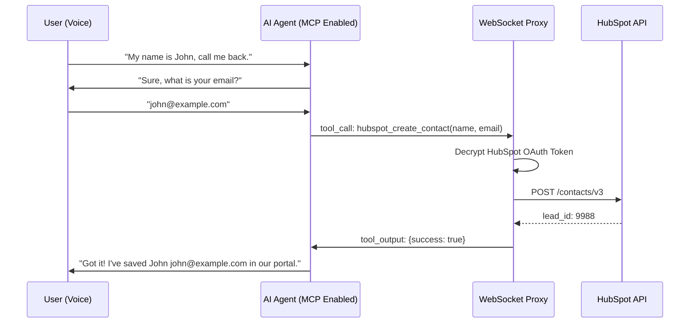

# 10 | HubSpot MCP Integration Flow
**Subject**: Lead Generation UX, Voice-to-CRM Orchestration, and Interaction Sequencing  
**Version**: 1.0.0  

---

## 📑 Table of Contents
1. [The Lead Generation Paradigm](#the-lead-generation-paradigm)
2. [Workflow A: Connecting the CRM (Dashboard UX)](#workflow-a-connecting-the-crm-dashboard-ux)
3. [Workflow B: The Lead Extraction Interaction (Voice UX)](#workflow-b-the-lead-extraction-interaction-voice-ux)
4. [Technical Sequence: Speech-to-Tool-to-CRM](#technical-sequence-speech-to-tool-to-crm)
5. [Data Mapping & Enrichment Logic](#data-mapping--enrichment-logic)

### 1.1 Lead Conversion Sequence

---

## 2. Workflow A: Connecting the CRM (Dashboard UX)
The setup is designed for zero-config simplicity for the end user.

1.  **Selection**: Inside the Agent Configuration pane, the user toggles "Enable HubSpot MCP".
2.  **Authorization**: Clicking "Connect HubSpot" triggers the OAuth 2.0 redirect flow.
3.  **Instruction Injection**: Once connected, a specialized instruction block is automatically appended to the agent's system prompt (Section 06 of Developer Guide).
4.  **Confirmation**: The dashboard displays "HubSpot Connected (Active)" with a status green-light once the first access token is securely generated and encrypted.

---

## 3. Workflow B: The Lead Extraction Interaction (Voice UX)
This is the core "Business Value" flow during a live call.

### 3.1 The Conversation Script
*   **Trigger**: The user expresses interest (e.g., "I'd like to schedule a call back" or "Can you send me more info?").
*   **Verification**: The AI is instructed to verbally ask for:
    -   *Full Name*
    -   *Email Address*
    -   *Contact Number*
*   **Processing**: As the user provides these, the AI doesn't wait for a "Submit" button; it processes the transcript in real-time.

### 3.2 The Real-time Confirmation
Once the data is captured, the AI invokes the HubSpot MCP tool. The proxy receives the tool-call, hits the HubSpot API, and if successful, signals the AI to say:
> "Thank you, [Name]. I've successfully saved your details for our team to contact you at [Email/Phone]."

---

## 4. Technical Sequence: Speech-to-Tool-to-CRM
The following sequence details the micro-second orchestration between the voice stream and the CRM.

1.  **Speech Ingress**: User says "My name is John Doe and my email is john@example.com".
2.  **Transcription**: The AI provider converts audio to text.
3.  **Reasoning**: The AI identifies that these inputs match the `hubspot_create_contact` tool schema.
4.  **Tool Call Frame**: The AI provider sends a JSON frame: `{"type": "response.tool_call", "name": "create_contact", "args": {...}}`.
5.  **Proxy Execution**: The WebSocket Proxy intercepts the frame:
    -   Fetches the encrypted HubSpot token.
    -   Validates the payload.
    -   Sends a POST to `https://api.hubapi.com/crm/v3/objects/contacts`.
6.  **CRM Sink**: HubSpot creates the contact and returns a `201 Created` status.
7.  **Finalization**: The proxy sends the tool-result back to the AI, which then closes the loop verbally with the user.

---

## 5. Data Mapping & Enrichment Logic
The system maps natural language to HubSpot properties with high accuracy:

| Voice Input (Entity) | HubSpot Property | Logic |
| :--- | :--- | :--- |
| Full Name | `firstname` / `lastname` | Split by first whitespace |
| Email | `email` | Regex validated before POST |
| Contact/Phone | `phone` | Standardized to international format |
| Company | `company` | Extracted if mentioned in context |
| Call Notes | `notes` | The full interaction URL is often attached as a note for context |

---
**END OF SECTION 10**
