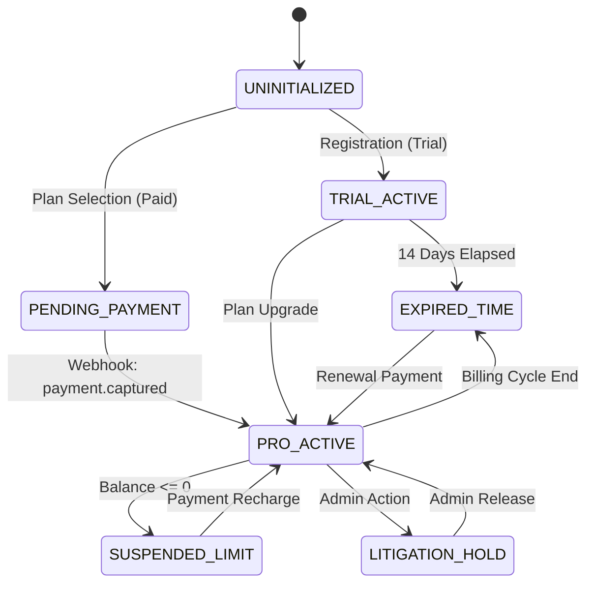
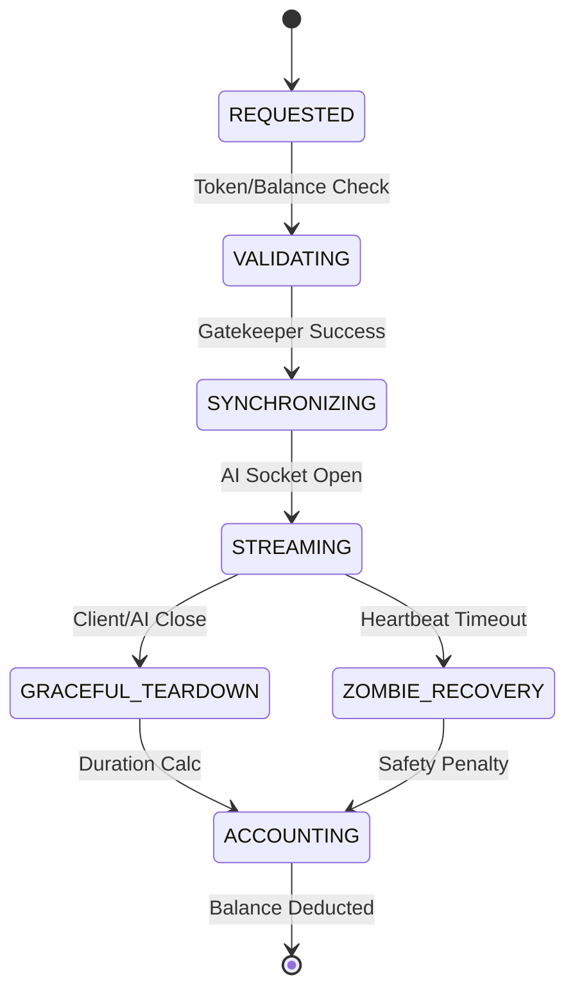

# 04 | State Transitions
**Subject**: Lifecycle Modeling and Behavioral State Machines  
**Version**: 1.2.0  
**Confidentiality**: Level 3 (Internal Engineering & Product Only)

---

## 📑 Table of Contents
1. [Introduction](#introduction)
2. [The Subscription State Machine (SSM)](#the-subscription-state-machine-ssm)
3. [The Interaction State Machine (ISM)](#the-interaction-state-machine-ism)
4. [Transition Matrix: Allowed & Forbidden](#transition-matrix-allowed--forbidden)
5. [Business Logic Synchronization](#business-logic-synchronization)
6. [Failure State Recovery](#failure-state-recovery)

---

## 1. Introduction
State management is the mechanism by which the platform enforces "Contextual Correctness." Because the platform involves real-time audio streams and asynchronous billing, the system must maintain a high-fidelity understanding of what a Tenant or an Interaction is doing at any given microsecond.

### 1.1 Subscription State Machine (Visual)

This document serves as the mapping for the state transitions that govern user access and session accounting.

---

## 2. The Subscription State Machine (SSM)
The SSM governs the "Macro-State" of the Tenant. It determines whether the Tenant's agents are allowed to "listen" or "speak."

### 2.1 Subscription States Defined
*   **UNINITIALIZED**: The "Zombie" state. The user has an account but has never completed a plan selection. No balance exists.
*   **PENDING_PAYMENT**: The user has requested a Pro/Business plan. The system is waiting for the Razorpay Webhook confirmation. 
*   **TRIAL_ACTIVE**: A time-limited (14 days) and volume-limited (50 mins) state. Transition to EXPIRED is automatic.
*   **PRO_ACTIVE / BIZ_ACTIVE**: The steady state. Handshaking is allowed. Balance is `> 0`.
*   **SUSPENDED_LIMIT**: The "Wall" state. The user has 0 minutes. Handshaking is blocked. Agents are deactivated.
*   **EXPIRED_TIME**: The billing cycle has ended. The user must renew to re-enter an ACTIVE state.
*   **LITIGATION_HOLD**: A manual state set by Admins for policy violations (fraud, abuse). No transitions possible without Admin intervention.

---

## 3. The Interaction State Machine (ISM)
The ISM governs the "Micro-State" of a single voice conversation. Failure to manage these states correctly results in "Usage Leakage."

### 3.1 Interaction Sequence (Real-time State)

### 3.1 Interaction Sequence
1.  **REQUESTED**: The WebSocket `Upgrade` request hits the Proxy. The session is un-metered but resource-locked.
2.  **VALIDATING**: The "Gatekeeper Phase." The proxy checks the database for tenant balance and agent status.
3.  **SYNCHRONIZING**: The Proxy establishes the secure bridge to the AI Provider. 
4.  **STREAMING**: The active conversation phase. Wall-clock time starts being "Reserved" in memory.
5.  **GRACEFUL_TEARDOWN**: A close frame is received (Client or AI). The socket is flushed.
6.  **ACCOUNTING**: The system performs the final duration calculation and database deduction.
7.  **ZOMBIE_RECOVERY**: A fallback state for sockets that died without a close frame (Heartbeat timeout).

---

## 4. Transition Matrix: Allowed & Forbidden

### 4.1 Allowed Transitions (The "Golden Path")
| From State | To State | Triggering Event |
| :--- | :--- | :--- |
| `DORMANT` | `TRIAL_ACTIVE` | Registration complete. |
| `ACTIVE` | `SUSPENDED` | Interaction ends with balance <= 0. |
| `SUSPENDED` | `ACTIVE` | Successful Payment Webhook received. |
| `TRIAL_ACTIVE` | `EXPIRED` | System cron detects 14-day passage. |

### 4.2 Forbidden Transitions (The "Security Holes")
*   **FORBIDDEN**: `SUSPENDED` -> `STREAMING`. (This is a Gatekeeper bypass).
*   **FORBIDDEN**: `EXPIRED` -> `ACTIVE` without a new `payment_id`.
*   **FORBIDDEN**: `STREAMING` -> `DORMANT`. (An interaction must always pass through `ACCOUNTING` before termination).

---

## 5. Business Logic Synchronization
States are enforced across three distributed layers:
1.  **Database layer**: Stores the persistent state (e.g., `is_active`, `minutes`).
2.  **API layer**: Validates state before allowing dashboard modifications.
3.  **Proxy layer**: Enforces state at the network level during handshakes.

**Rule of Synchronicity**: If the Database says `SUSPENDED`, the Proxy MUST NOT allow a handshake, even if the user still has an open browser tab from when they were `ACTIVE`.

---

## 6. Failure State Recovery
If an interaction transitions into a **FAILURE** state (e.g., AI Provider API timeout or Proxy crash during accounting):
*   **Fail-Safe**: The system MUST assume a minimum 1-second duration.
*   **Deduction Recovery**: If the `ACCOUNTING` phase fails, the interaction ID is moved to a `failed_deductions` queue for re-processing within 5 minutes.

---
**END OF SECTION 04**
