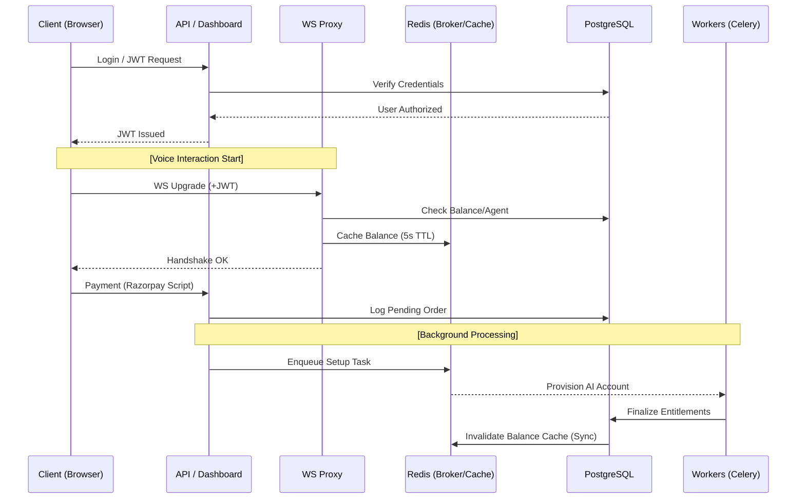

# 06 | Workflows
**Subject**: Technical Sequence Flows and Service Orchestration  
**Version**: 1.2.0  
**Confidentiality**: Level 3 (Internal Engineering & Product Only)

---

## 📑 Table of Contents
1. [Introduction](#introduction)
2. [Workflow W-101: The Handshake & Authorization Loop](#workflow-w-101-the-handshake--authorization-loop)
3. [Workflow W-102: Real-time Audio Proxying](#workflow-w-102-real-time-audio-proxying)
4. [Workflow W-103: The Post-Interaction Accounting Loop](#workflow-w-103-the-post-interaction-accounting-loop)
5. [Workflow W-201: The Account Suspension / Cascade Deactivation](#workflow-w-201-the-account-suspension--cascade-deactivation)
6. [Workflow W-301: The Monthly Renewal & Payment Loop](#workflow-w-301-the-monthly-renewal--payment-loop)
7. [Workflow W-401: CRM Lead Extraction & Sync (HubSpot)](#workflow-w-401-crm-lead-extraction--sync-hubspot)

---

## 1. Introduction
Workflows define the "Choreography" of the system. While State Transitions (Section 04) define where the system *is*, Workflows define how it *gets there*.

These flows are designed to be high-performance, resilient to network jitter, and financially accurate. Every step listed here corresponds to a module in the Backend Service or the WebSocket Proxy.

---

## 2. High-Level Service Choreography

---

## 2. Workflow W-101: The Handshake & Authorization Loop
This workflow occurs within the first 200ms of a connection attempt.

1.  **Ingress**: Load Balancer (LB) receives a WebSocket `Upgrade` request via `wss://api.platform.com/v1/voice`.
2.  **Extraction**: The Proxy server extracts the `JWT` from the request header and the `agent_id` from the URL parameter.
3.  **Authentication**: The Proxy validates the JWT signature and extracts the `user_id`.
4.  **The Gatekeeper Invocation**: The Proxy sends a synchronous internal gRPC/HTTP request to the `UsageEngine`: `check_access(user_id, agent_id)`.
5.  **Database Lookup**: The `UsageEngine` executes two parallel checks:
    -   *Check A*: Is the Agent `is_active == True`?
    -   *Check B*: Is the `UserMinuteBalance.remaining_seconds > 0`?
6.  **Authorization Denial**: If either check fails, the Proxy returns a `403 Forbidden` and terminates the upgrade.
7.  **Authorization Approval**: If both pass, the Proxy returns `HTTP 101 Switching Protocols` to the client.

---

## 3. Workflow W-102: Real-time Audio Proxying
This workflow manages the active data stream.

1.  **Upstream Bridge**: Upon handshake completion, the Proxy opens a separate WebSocket to the AI Provider’s Realtime API.
2.  **Context Injection**: The Proxy sends the Agent's specific `System Instructions`, `Voice ID`, and `Model Settings` as the first frame to the AI Provider.
3.  **Timestamp Anchor**: The Proxy records `started_at = monotonic_time()`.
4.  **The Bidirectional Loop**:
    -   *Client -> Proxy*: Raw PCM16 audio blocks.
    -   *Proxy -> AI Provider*: Transcoding (if necessary) and forwarding.
    -   *AI Provider -> Proxy*: AI text/audio response frames.
    -   *Proxy -> Client*: Real-time audio playback data.
5.  **Health Monitoring**: The Proxy monitors for "Inactivity Timeouts" and "Malicious Traffic Patterns" in the stream.

---

## 4. Workflow W-103: The Post-Interaction Accounting Loop
This workflow is triggered by the closure of the socket.

1.  **Termination Trigger**: The client sends a `close` frame OR the Proxy detects a TCP FIN packet from the AI Provider.
2.  **Finalization**: The Proxy captures `ended_at = monotonic_time()`.
3.  **Duration Calculation**: `raw_duration = ended_at - started_at`.
4.  **Rule Application**: `billable = ceil(max(1, raw_duration))`. (Applying BR-102 & BR-103).
5.  **The Transactional Write**: 
    -   The `UsageService` initiates a DB transaction.
    -   *Step A*: Subtract `billable` from `UserMinuteBalance.remaining_seconds`.
    -   *Step B*: Create a row in the `Interactions` table with the final duration and status `COMPLETED`.
6.  **Webhook Notification**: The platform sends an optional webhook to the user's dashboard with the final interaction metrics.

---

## 5. Workflow W-201: The Account Suspension / Cascade Deactivation
This is the platform's self-defense mechanism against overages.

1.  **Balance Breach**: During Workflow W-103, if the new `remaining_seconds` is `<= 0`.
2.  **The Shutdown Sequence**:
    -   The system identifies all agents belonging to the `user_id`.
    -   An administrative command is issued: `UPDATE agents SET is_active = False WHERE user_id = :id`.
3.  **Caching Flush**: The `is_active` status change is propagated to the Proxy layer's cache to ensure immediate enforcement on new handshakes.
4.  **Customer Notification**: An automated email/dashboard alert is sent: "Balance Exhausted. Agents have been deactivated."

---

## 6. Workflow W-301: The Monthly Renewal & Payment Loop
This workflow handles the replenishment of the "Minute Bank."

1.  **Billing Event**: The customer successfully pays via the Dashboard (Razorpay).
2.  **Payment Recognition**: Razorpay sends a `payment.captured` webhook.
3.  **The Crediting Transaction**:
    -   The `PaymentWorker` validates the `transaction_id`.
    -   Total minutes from the plan (e.g., 350) are converted to seconds (21,000).
    -   `UserMinuteBalance.total_seconds` is incremented.
    -   `UserMinuteBalance.remaining_seconds` is recalculated.
4.  **The Resurrection Sequence**: 
    -   If the account was previously `SUSPENDED`, the system sets `Agent.is_active = True` for all of the user's agents.
    -   The user receives a "Plan Refilled" confirmation.

---

## 7. Workflow W-401: CRM Lead Extraction & Sync (HubSpot)
This workflow handles the transformation of voice conversation into structured business data.

1.  **Intent Detection**: During a live conversation (Workflow W-102), the AI detects a "Lead Generation Intent" based on user interest or contact sharing.
2.  **Entity Extraction**: The AI enters a "Data Collection State," verbally prompting the user for Name, Email, and Phone.
3.  **Tool-Call Interception**: Upon capturing sufficient data, the AI generates a Tool Call.
4.  **The Middleware Bridge**: The Proxy intercepts the call and attempts a secure POST to the connected CRM (HubSpot).
5.  **Synchronization Success**:
    -   If HubSpot returns `201`, the Proxy confirms the "Commit" to the AI.
    -   The interaction is tagged with `lead_captured = True`.
6.  **Fail-Safe**: If the CRM sync fails (e.g., token expired), the Proxy logs the lead details in the Interaction transcript as a backup and signals the AI to proceed without verbal confirmation of the sync.

---
**END OF SECTION 06**
