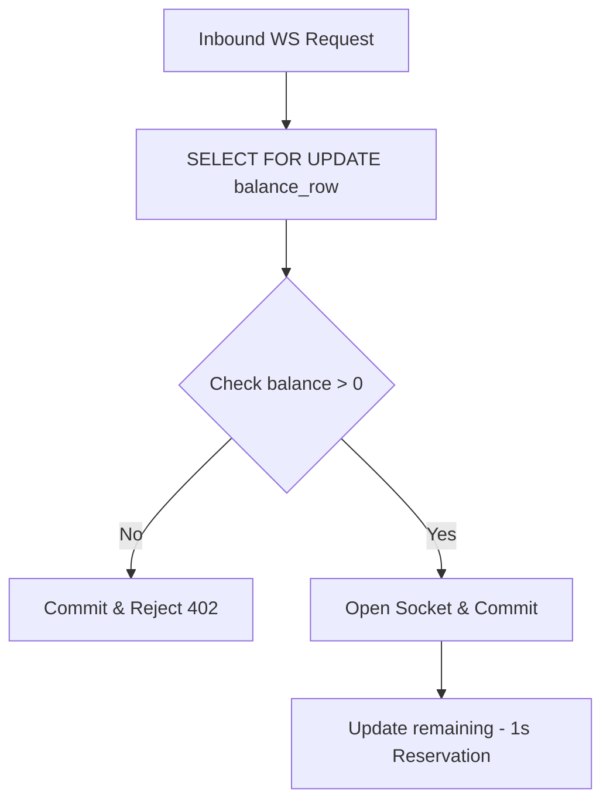
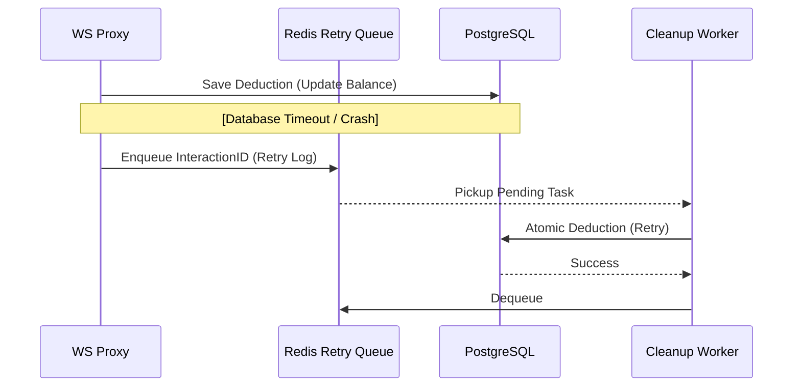

# 07 | Security & Failure Handling
**Subject**: Systemic Reliability, Fraud Mitigation, and Edge Case Audit  
**Version**: 1.2.0  
**Confidentiality**: Level 3 (Internal Engineering & Product Only)

---

## 📑 Table of Contents
1. [Introduction](#introduction)
2. [Physical & Logical Security Enforcement](#physical--logical-security-enforcement)
3. [Multi-Tenant Isolation Architecture](#multi-tenant-isolation-architecture)
4. [Fraud & Abuse Mitigation Patterns](#fraud--abuse-mitigation-patterns)
5. [Comprehensive Failure Mode Audit (15+ Edge Cases)](#comprehensive-failure-mode-audit-15-edge-cases)
6. [Resilience & Fail-over Strategies](#resilience--fail-over-strategies)

---

## 1. Introduction
A Voice AI system that handles real-time data and financial credits must be defensive by design. The combination of expensive AI processing and the "Open Internet" exposure of widgets creates a high-surface-area risk for the business.

This document outlines the security guardrails and the programmatic responses to systemic failures. The goal is to ensure that under "Chaos" conditions, the platform "Fails Safely"—meaning it protects revenue and data integrity over service availability in extreme scenarios.

---

## 2. Physical & Logical Security Enforcement

### 2.1 JWT-Based Authorization
The platform rejects all handshake requests that do not carry a valid, RS256-signed JSON Web Token.
-   **Validation**: Every request is checked for expiration (`exp`) and audience (`aud`).
-   **Credential Secrecy**: AI Provider API keys are NEVER stored on the client side. They are securely injected by the Proxy during the Realtime bridge initialization.

### 2.2 Domain Whitelisting (CORS Upgrade)
Because the Voice Widget is public, an attacker could scrape an `agent_id` and host it on an unauthorized site.
-   **Security Check**: The Proxy verifies the `Origin` header against the `Agent`’s whitelist. 
-   **Hard Rejection**: If the domain is not authorized, the connection is killed before the AI context is even loaded.

---

## 3. Multi-Tenant Isolation Architecture

The platform uses a **Logical Isolation** model.
-   **Row-Level Scoping**: Every SQL query for billing or agent configuration MUST include a `WHERE user_id = :authenticated_user_id` clause.
-   **Execution Isolation**: Interaction threads in the Proxy layer are pinned to a specific `user_id`, ensuring a memory leak or crash in one tenant's session cannot corrupt another's state.

---

## 4. Fraud & Abuse Mitigation Patterns

### 4.1 The Concurrent Handshake Attack
A user with 1 second left tries to open 500 WebSocket connections at the exact same millisecond.
-   **Defense**: Implementation of a **Pessimistic Row Lock** on the `UserMinuteBalance` record during the `VALIDATING` phase of the handshake. This forces the 500 requests to serialize, ensuring only the first request succeeds.

#### 4.2 Lock & Validate Sequence

### 4.2 Widget Script Scraping
-   **Defense**: Rate limiting at the IP level. If an IP address initiates more than 10 handshakes per minute without a valid user session, it is temporary blacklisted.

---

## 5. Comprehensive Failure Mode Audit (15+ Edge Cases)

The following matrix represents the "Known Unknowns" and the system's hard-coded response.

| # | Scenario | System Response | Rationale |
| :--- | :--- | :--- | :--- |
| **01** | **AI Provider Socket Hang** | Max Interaction Cap (120 min). | Prevents "Zombie usage" from draining a user's wallet. |
| **02** | **DB Post-Call Deduction Fail** | Retry Queue (Redis) with Backoff. | Ensures eventual consistency of the balance. |
| **03** | **Clock Drift between Nodes** | Use absolute Monotonic timers. | Prevents inaccurate billing due to server clock jumps. |
| **04** | **Zero-Second Handshake Race** | Atomic `SELECT FOR UPDATE`. | Prevents simultaneous "Free Seconds" usage. |
| **05** | **Merchant Refund Overrun** | Net-Negative Balance allowed. | Reflects financial reality; debt must be cleared before reuse. |
| **06** | **Half-Open TCP Connection** | Socket Heartbeat (Keep-alive). | Detects silent client crashes within 60 seconds. |
| **07** | **Large Token Volatility** | Minute-based average capping. | Protects the platform from ultra-dense AI monologues. |
| **08** | **Database Primary Down** | Handshake Fail-Closed. | Better to reject a call than to lose the revenue metric. |
| **09** | **Agent Deleted mid-call** | Call allowed to finish. | Session context is frozen at handshake. |
| **10** | **Proxy Process Crash** | 1-minute minimum "safety" bill. | Applied during background process cleanup task. |
| **11** | **Duplicate Razorpay Webhook** | Idempotency Key check. | Prevents double-credit of minutes. |
| **12** | **"The Silence Loop"** (VAD fail) | 5-minute inactivity kill switch. | Prevents billing a user for an empty room. |
| **13** | **Admin Accidental Deletion** | Soft-delete only (30 day window). | Allows for human-error recovery in critical accounts. |
| **14** | **High-Frequency Ping Attack** | Application Layer WAF. | Drops malformed handshake frames at the edge. |
| **15** | **JWT Replay Attack** | Nonce tracking (Short-lived tokens). | Limits the window for credential theft. |
| **16** | **"Infinite Tool" Loop** | Max 5 Recursive Model calls. | Kills the interaction if the AI enters a logic loop. |

---

## 6. Resilience & Fail-over Strategies

### 6.1 Accounting Failure Recovery

### 6.1 The "Stale Cache" Problem
Proxy nodes cache balance data for performance.
-   **Strategy**: Cache TTL (Time-To-Live) is strictly set to 5 seconds. If a payment occurs, the `PaymentWorker` issues a global **Cache Invalidation** event via Redis Pub/Sub to all proxy nodes.

### 6.2 Data Poisoning Protection
If a user tries to inject malicious JSON into the `metadata` field of an interaction:
-   **Strategy**: Strict JSON-Schema validation on the API Ingress. Any malformed or oversized metadata is stripped or the request is rejected.

---
**END OF SECTION 07**
