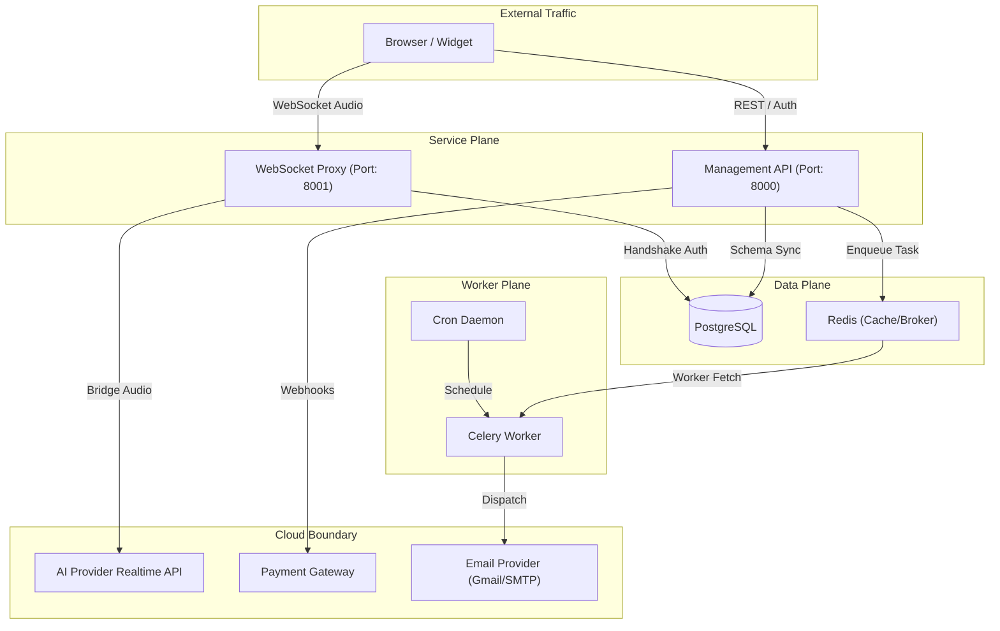

# 01 | System Overview
**Subject**: High-Level Architecture, Service Interaction, and Technology Stack  
**Version**: 1.2.0  

---

## 📑 Table of Contents
1. [Core Architecture](#core-architecture)
2. [Service Components](#service-components)
3. [Technology Stack](#technology-stack)
4. [Cross-Service Orchestration](#cross--service-orchestration)
5. [Data Flow Lifecycle](#data-flow-lifecycle)

---

## 1. Core Architecture
The Voice AI SaaS Platform is architected as a decoupled, multi-tier system designed for ultra-low latency audio processing and scalable tenant management. The system follows a **Service-Oriented Architecture (SOA)** with a clear separation between the administrative plane (Dashboard), the management plane (API), and the execution plane (Proxy).

### 1.1 Architectural Philosophy
*   **Asynchronous-First**: Every core path in the backend utilizes non-blocking I/O to handle concurrent WebSocket sessions without thread exhaustion.
*   **Logical Multi-Tenancy**: Data is segregated at the record level using tenant identifiers (`user_id`), ensuring cost-efficient scaling.
*   **Ephemeral Proxying**: The proxy layer is designed to be stateless, allowing for horizontal scaling across geographical regions.

---

## 2. Service Components

### 2.1 The Administrative Plane (Frontend Dashboard)
A React-based single-page application (SPA) that provides the user interface for agent configuration, usage monitoring, and subscription management.
*   **Environment**: Vite-powered React environment.
*   **Primary Responsibility**: State management for user-agent definitions and observability.

### 2.2 The Management Plane (Main API)
A FastAPI application responsible for administrative CRUD, authentication, and billing state.
*   **Environment**: Python 3.10+ / FastAPI.
*   **Primary Responsibility**: Enforcing business rules, processing payments, and maintaining the relational source of truth.

### 2.3 The Execution Plane (WebSocket Proxy)
The highly specialized real-time component that bridges audio between the web widget and the upstream AI provider.
*   **Environment**: Async Python / FastAPI / WebSockets.
*   **Primary Responsibility**: Real-time duration metering, audio transcoding, and secure AI provider orchestration.

---

## 3. Technology Stack

### 3.1 Backend (Python Ecosystem)
*   **Framework**: FastAPI (Selected for native async support and Pydantic-driven validation).
*   **Asynchronous Tasks**: **Celery** (Distributed task queue for non-blocking operations like email dispatch).
*   **Message Broker & Caching**: **Redis** (In-memory data store for state management, task brokering, and caching).
*   **Scheduling**: **Cron Jobs** (Unix-based scheduling for periodic background operations and usage reports).
*   **Persistence**: SQLAlchemy 2.0 with PostgreSQL (Production) for relational integrity.
*   **Real-time Communication**: `websockets` library and FastAPI's native WebSocket support.
*   **Security**: `PyJWT` for tokenization and `cryptography` for AES-256 field-level encryption.

### 3.2 Frontend (JS/TS Ecosystem)
*   **Framework**: React 18+ with Vite.
*   **State Management**: Zustand (Minimalist global state for authentication and session context).
*   **Data Fetching**: TanStack Query (React Query) for caching and optimistic updates.
*   **Styling**: Vanilla CSS / Tailwind for high-fidelity UI components.

---

## 4. Cross-Service Orchestration

The platform utilizes a structured communication flow to maintain consistency across services.

### 4.1 Orchestration Diagram

---

## 5. Data Flow Lifecycle

### 5.1 The Interaction Lifecycle
1.  **Request Phase**: The Client requests a session; the proxy performs a sub-100ms lookup in the DB to verify balance and agent status.
2.  **Engagement Phase**: A bidirectional WebSocket is opened; audio PCM16 frames flow through the server.
3.  **Finalization Phase**: On disconnect, the server calculates wall-clock time, executes an atomic decrement in the DB, and commits an interaction log.

---
**END OF SECTION 01**
