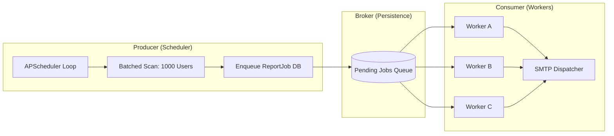

# 02 | Backend Architecture
**Subject**: FastAPI Orchestration, Scalable Scheduling, and Service-Layer Patterns  
**Version**: 1.5.0  

---

## 📑 Table of Contents
1. [Core Architectural Philosophy](#core-architectural-philosophy)
2. [Distributed Task Orchestration (APScheduler & Workers)](#distributed-task-orchestration-apscheduler--workers)
3. [The Service Layer Pattern](#the-service-layer-pattern)
4. [Data Persistence & Migrations](#data-persistence--migrations)
5. [Security Perimeter & Lifecycle Management](#security-perimeter--lifecycle-management)
6. [Operational Observability](#operational-observability)

---

## 1. Core Architectural Philosophy
The backend is a high-concurrency, asynchronous engine built on **FastAPI**. It follows a strictly modular design to decouple purely stateless API logic from stateful real-time proxying and long-running background orchestration.

### 1.1 Process Model
The platform operates under a multi-process/multi-threaded hybrid model:
*   **API Process (Gunicorn/Uvicorn)**: Handles incoming REST requests. This process is primarily I/O-bound and leverages Python's `asyncio` for high throughput.
*   **Background process (ReportScheduler)**: A dedicated thread-safe singleton (via `apscheduler`) that manages high-volume report generation and cron-based billing reconciliation.
*   **Worker Pool (Celery)**: Offloads heavy computation (e.g., PDF generation, complex report processing) to distributed workers using **Redis** as the message broker.

---

## 2. Distributed Task Orchestration (APScheduler & Workers)
A critical component of the architecture is the `ReportScheduler`, specifically optimized for **100,000+ users**.

### 2.1 Producer-Consumer Worker Flow

### 2.2 The High-Scale Scheduler (`scheduler.py`)
Unlike standard cron implementations, the scheduler uses a producer-consumer pattern to prevent database bottlenecks:
*   **Job Creation (Producer)**: Every Monday (Weekly) or 1st of the month (Monthly), the system performs a batched scan (`JOB_CREATION_BATCH = 1000`) of the database to enqueue `ReportJob` records.
*   **Job Processing (Consumer)**: A recurring task runs every minute (`PROCESS_INTERVAL = 1`) to pick up pending jobs in chunks (`BATCH_SIZE = 500`).
*   **Concurrency**: Uses a `ThreadPoolExecutor` with **10 concurrent workers** to process email dispatching without blocking the main event loop.

### 2.2 Celery & Redis Integration
For tasks requiring cross-process persistence (like account setup or password resets), the system uses Celery:
*   **Broker**: Redis (Primary).
*   **Persistence**: Task results are partially stored in Postgres to provide SuperAdmins with visibility into worker health.

---

## 3. The Service Layer Pattern
To prevent "Fat Routers," the business logic is abstracted into `services/`.

### 3.1 `ReportService` & `EmailService`
*   **Abstraction**: Routers only handle request validation (Pydantic) and dependency resolution. They delegate to `ReportService` for data aggregation and `EmailService` for SMTP/Template rendering.
*   **Transactionality**: Services operate using `SessionLocal` for atomic commit/rollback behavior, particularly critical during the "Wallet Refill" flow where failure to log a transaction must revert balance updates.

---

## 4. Data Persistence & Migrations
The database architecture is designed for vertical scalability and strict data integrity.

### 4.1 Schema Lifecycle
*   **SQLAlchemy 2.0**: Leverages modern typed models for better developer experience and performance.
*   **Postgres Enums**: The system implements custom migration logic (`main.py`) to ensure PostgreSQL enum types (`agenttype`, `noisereductionmode`) are provisioned safely during startup.
*   **Auto-Migration Hooks**: On startup, the `migrate_agent_foreign_key` logic checks for schema inconsistencies and atomically fixes legacy constraints to ensure data consistency between the `Agents` and `ServiceAccountKey` tables.

---

## 5. Security Perimeter & Lifecycle Management
Security is enforced through a combination of FastAPI Dependencies and global middleware.

### 5.1 The Lifespan Protocol
The `lifespan` handler manages the application lifecycle:
1.  **Startup**: Initializes the global `ReportScheduler`, verifies database connectivity, and ensures Redis is reachable.
2.  **Running**: Monitors active WebSocket sessions.
3.  **Shutdown**: Gracefully drains pending scheduler jobs and closes SQLAlchemy engine pools to prevent connection leaks.

### 5.2 Dependency Injection (DI)
The platform uses DI for:
*   **`get_db`**: Automated session provisioning and teardown.
*   **`get_current_user`**: JWT validation and RBAC (Role-Based Access Control).
*   **`require_active_subscription`**: Middleware-level gating that prevents API access if the user's `SubscriptionStatus` is invalid or balance is zero.

---

## 6. Operational Observability
The backend implements tiered logging and exception handling.

### 6.1 Global Exception Mapping
Specialized handlers translate system-level errors into actionable client responses:
*   **HTTP 402**: Triggered by `InsufficientBalanceError`.
*   **HTTP 422**: Standardized validation errors.
*   **HTTP 500**: Captures stack traces in `debug` mode for developers, while providing a sanitized "Internal Server Error" in production.

### 6.2 Real-time Proxy Logging
The `openai_logger` provides a high-fidelity audit trail of WebSocket signaling, allowing support teams to debug call quality issues without exposing sensitive user audio data.

---
**END OF SECTION 02**
