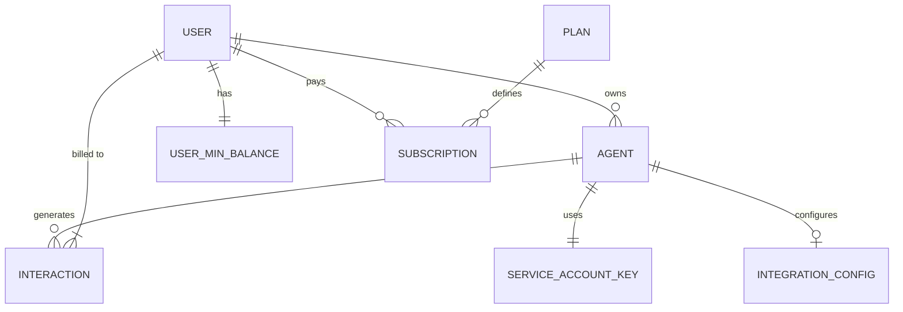

# 03 | Database Models
**Subject**: Relational Schema, SQLAlchemy Entity Mappings, and Financial Ledger Logic  
**Version**: 1.5.0  

---

## 📑 Table of Contents
1. [Schema Hierarchy & Root Entities](#schema-hierarchy--root-entities)
2. [AI Persona & Configuration Models (Agents)](#ai-persona--configuration-models-agents)
3. [The Financial Engine (Subscriptions & Credits)](#the-financial-engine-subscriptions--credits)
4. [Interaction Analytics & Token Tracking](#interaction-analytics--token-tracking)
5. [Operational State (Integrations & Tokens)](#operational-state-integrations--tokens)
6. [Persistence Integrity & Indexing Strategy](#persistence-integrity--indexing-strategy)

---

## 1. Schema ERD (High-Level)

---

## 1. Schema Hierarchy & Root Entities
The platform utilizes a multi-tenant relational schema where all entities are horizontally partitioned by a `user_id`.

### 1.1 The User Entity (`users`)
The central node of the graph.
*   **Identity**: `email` (Unique), `username`.
*   **State**: `is_active` (Account status), `password_set` (Onboarding flag).
*   **Permissions**: `role` (ENUM: `ADMIN`, `USER`). Note: `ADMIN` bypasses subscription gates.

---

## 2. AI Persona & Configuration Models (Agents)
The `agents` table defines the behavioral and technical profile of the voice assistant.

### 2.1 The Agent Model (`Agent`)
*   **Formation Logic**: Stored attributes include `system_prompt` (core brain), `voice` (provider TTS selection), and `agent_config` (JSON block for tools and guardrails).
*   **Noise Optimization**: Implements granular VAD (Voice Activity Detection) settings:
    *   `noise_reduction_mode`: `near_field`/`far_field`.
    *   `noise_reduction_threshold`: VAD sensitivity (default: 0.5).
    *   `padding_ms` & `silence_duration_ms`: Buffering logic for natural turn-taking.
*   **Type Segregation**: `agent_type` determines the ingress point (`WEB` for WebSocket, `PHONE` for Telephony).

---

## 3. The Financial Engine (Subscriptions & Credits)
Managed through three interconnected models to ensure ledger consistency.

### 3.1 Plan Definitions (`plans`)
*   **Attributes**: `wallet_credits`, `minutes`, `price`, `currency` (Multi-currency support).
*   **Logic**: Differentiation between `is_trial` (14-day limit) and `paid` status.

### 3.2 Live Credit Balance (`user_min_balance`)
Acts as the systemic gatekeeper.
*   **Fields**: `total_seconds`, `used_seconds`, `remaining_seconds`.
*   **Mechanism**: Every WebSocket closure triggers an atomic SQL update where `used_seconds` increases and `remaining_seconds` decreases based on actual interaction duration.

### 3.3 Subscription Lifecycle (`subscriptions`)
*   **State**: `payment_status` (PENDING -> SUCCESS/FAILED).
*   **Integration**: Stores `razorpay_order_id` and `razorpay_signature` for auditability and webhook reconciliation.

---

## 4. Interaction Analytics & Token Tracking
The `interactions` model is the most data-dense table, capturing granular usage metrics.

### 4.1 Real-Time Token Tracking
Unlike simple duration-based billing, the system tracks official OpenAI token usage for precision COGS analysis:
*   **Input**: `audio_input_tokens`, `text_input_tokens`.
*   **Output**: `audio_output_tokens`, `text_output_tokens`.
*   **Costing**: Implements a dedicated `calculate_real_cost` utility that applies current provider pricing + a systemic **10% markup** (`total_cost`).

### 4.2 Conversation State
*   **Transcripts**: Stores the full history of User and Assistant turns.
*   **Observability**: Maps `origin_domain` for widget tracking and `session_id` for WebSocket log correlation.

---

## 5. Operational State (Integrations & Tokens)
Models for the platform's extended capabilities.

### 5.1 Service Account Keys (`service_account_key`)
*   **Security**: Stores provider-specific credentials. Note: These are decrypted at runtime (Section 07).
*   **Ownership**: One User can own multiple keys, allowing different agents to point to different billing profiles.

### 5.2 Integration Configs (`integration_config`)
*   **CRM Sync**: Specifically manages HubSpot MCP (Model Context Protocol) states, including `instructions` for the AI to handle CRM lead extraction during voice calls.

---

## 6. Persistence Integrity & Indexing Strategy
To maintain sub-100ms handshake performance:

*   **Primary Indexing**: BTREE indexes on `session_id`, `user_id`, and `agent_id`.
*   **Constraint Policies**: 
    *   `agents.id` references `service_account_key.id` (Restricts agents to validated keys).
    *   `plans` use a `JSON` block for features to allow schema-less evolution of plan benefits.
*   **Migrations**: Managed via **Alembic**, with automated startup checks `main.py` to fix cross-table foreign key constraints during the MVP transition.

---
**END OF SECTION 03**
