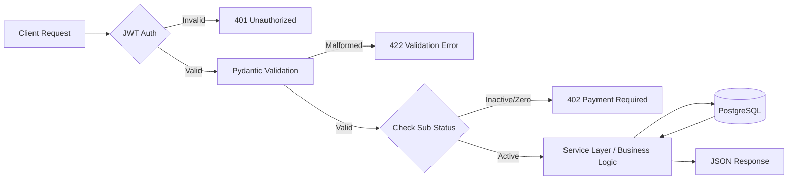

# 04 | API Specification
**Subject**: REST Endpoints, WebSocket Protocols, and Integration Maps  
**Version**: 1.2.0  

---

## 📑 Table of Contents
1. [API Architecture Overview](#api-architecture-overview)
2. [Identity & Access Control (Auth)](#identity--access-control-auth)
3. [AI Voice Persona Management (Agents)](#ai-voice-persona-management-agents)
4. [Financial & Subscription Systems (Payments)](#financial--subscription-systems-payments)
5. [Operational Analytics (Dashboard & Reports)](#operational-analytics-dashboard--reports)
6. [Real-time Ingress (Widget & WebSockets)](#real-time-ingress-widget--websockets)
7. [Standard Error Schema](#standard-error-schema)

---

## 1. API Architecture Overview
The Voice AI Platform exposes a RESTful interface for management and a stateful WebSocket interface for real-time voice streaming. The API is built on **FastAPI**, leveraging Pydantic for strict schema validation and JWT for stateless session management.

### 1.1 Request Lifecycle Flow


---

## 2. Identity & Access Control (Auth)
The `/api/auth` domain handles the user lifecycle and security perimeter.

### 2.1 Registration & Onboarding
*   **`POST /api/auth/register-with-plan`**: Initializes a prospect account.
    *   **Payload**: `{ "email": "str", "username": "str", "plan_id": "int" }`
    *   **Sequence**: Creates an inactive `User` and dispatches a Celery task for the payment/setup email.
*   **`POST /api/auth/setup-password`**: Activates the account.
    *   **Payload**: `{ "token": "uuid", "password": "str" }`
    *   **Requirement**: Valid `PaymentToken` and (for paid plans) a successful Razorpay transaction.

### 2.2 Session Management
*   **`POST /api/auth/login`**: Authenticates and issues a JWT.
    *   **Logic**: Verifies Bcrypt hash and checks subscription validity.
*   **`GET /api/auth/me`**: Returns the `current_user` context, including `remaining_minutes` and `wallet_balance`.

### 2.3 Security Workflows
*   **`POST /api/auth/forget-password`**: Triggers a secure reset loop via Gmail.
*   **`PUT /api/auth/change-password`**: Authenticated password rotation.

---

## 3. AI Voice Persona Management (Agents)
The `/api/agents` domain provides CRUD operations for voice configurations.

### 3.1 Lifecycle Endpoints
*   **`GET /api/agents`**: Lists all agents for the current user. Supports `key_id` filtering.
*   **`POST /api/agents`**: Creates a new persona (Formation).
    *   **Schema**:
        ```json
        {
          "name": "Support Bot",
          "instructions": "JSON or Plain Text Prompt",
          "voice": "alloy",
          "openai_key_id": "int",
          "noise_reduction_mode": "near_field",
          "noise_reduction_threshold": "0.5"
        }
        ```
*   **`GET /api/agents/{id}`**: Retrieves granular configuration for a specific agent.
*   **`PUT /api/agents/{id}`**: Dynamic update of instructions or voice parameters.

---

## 4. Financial & Subscription Systems (Payments)
The `/api/payments` domain orchestrates Razorpay transitions and ledger updates.

### 4.1 Subscription Orchestration
*   **`POST /api/payments/create-order`**: Generates a `razorpay_order_id` for a specific plan.
*   **`POST /api/payments/verify`**: Validates the Razorpay HMAC signature and performs:
    1.  Atomic balance provisioning.
    2.  OpenAI Service Account creation.
    3.  Subscription activation.

### 4.2 Wallet Operations
*   **`POST /api/payments/wallet-topup/create-order`**: Initiates a balance refill.
*   **`POST /api/payments/wallet-topup/verify`**: Reconciles the refill and updates the `UserMinuteBalance`.

---

## 5. Operational Analytics (Dashboard & Reports)
The `/api/dashboard` and `/api/reports` domains power the observability HUD.

### 5.1 Real-time HUD
*   **`GET /api/dashboard/stats`**: Returns the 4 core KPI cards:
    *   `total_interactions`: Engagement volume.
    *   `total_expenses`: COGS monitoring (SuperAdmin).
    *   `total_agents`: Deployment breadth.
    *   `total_minutes`: Burn reconciliation.
    *   **Params**: `days` (7d/30d/90d), `user_id` (impersonation filter).

### 5.2 Reporting Dispatch
*   **`POST /api/dashboard/expenses-per-user/send-email`**: Triggers a background report generation for SuperAdmins.

---

## 6. Real-time Ingress (Widget & WebSockets)
The `/api/widget` domain handles the "Last Mile" interaction.

### 6.1 Code Generation
*   **`GET /api/widget/codeFixed/agent/{id}`**: Returns the JavaScript snippet for a specific agent.

### 6.2 The Voice Handshake (WebSocket)
*   **`WS /api/widget/stream`**: The real-time gateway.
    *   **Handshake**: Requires the `agent_id` passed via headers or query params.
    *   **Bridge logic**: The Proxy opens a secondary secure socket to the AI Provider, injecting the agent's instructions (Section 03) into the session context.
    *   **Termination**: Upon socket close, the `Interaction` is finalized, and billing is triggered.

---

## 7. Standard Error Schema
All REST endpoints adhere to a consistent error envelope:
```json
{
  "detail": "Descriptive error message",
  "error_code": "OPTIONAL_SYSTEM_CODE",
  "status_code": 400
}
```
**Common Codes**:
- `401 Unauthorized`: Missing or invalid JWT.
- `402 Payment Required`: Expired subscription or zero balance.
- `403 Forbidden`: Cross-tenant access attempt.
- `404 Not Found`: Entity (Agent/Key/Order) does not exist.

---
**END OF SECTION 04**
