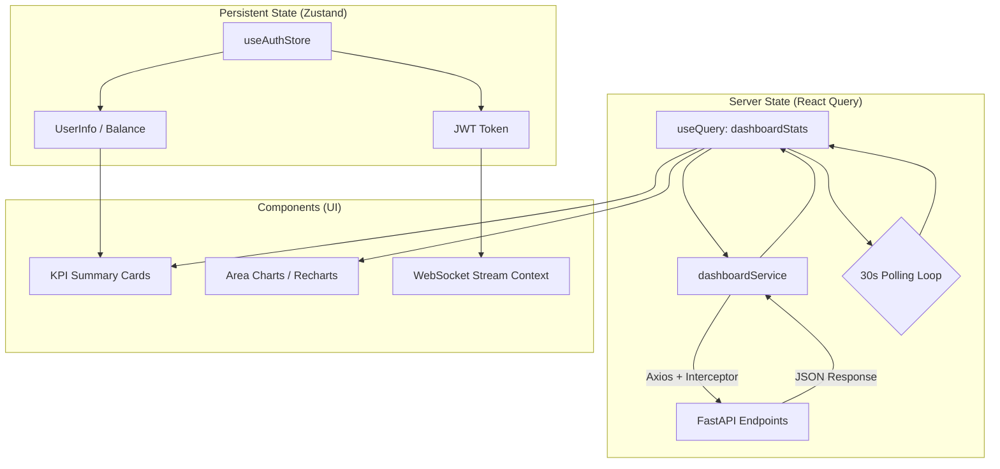

# 05 | Frontend Dashboard
**Subject**: React Architecture, State Orchestration, and Data Visualization  
**Version**: 1.5.0  

---

## 📑 Table of Contents
1. [Frontend Stack Philosophy](#frontend-stack-philosophy)
2. [State Management (Zustand & Context)](#state-management-zustand--context)
3. [Data Orchestration (React Query)](#data-orchestration-react-query)
4. [The Dashboard Information Architecture](#the-dashboard-information-architecture)
5. [Visualization Engine (Recharts)](#visualization-engine-recharts)
6. [Operational Utilities (Toast & Export)](#operational-utilities-toast--export)

---

## 2. State & Data Orchestration
The frontend acts as a reactive observer of the backend's state.

### 2.1 Frontend Data Flow

### 2.1 Identity State (`authStore.js`)
*   **Component Composition**: Highly modular components (Summary Cards, Chart Wrappers, Modals) reside in `src/components`, while business logic is concentrated in `src/pages`.
*   **Declarative UI**: The UI reacts to state changes via hooks, ensuring a consistent user experience during data transitions.

---

## 2. State Management (Zustand & Context)
The platform uses a tiered state management approach to balance persistence and performance.

### 2.1 Identity State (`authStore.js`)
Powered by **Zustand**, the `useAuthStore` manages the user's secure session:
*   **Stateless JWT**: Tokens are stored in memory/localStorage and automatically appended to every Axios request via interceptors.
*   **Session Persistence**: Handles login/logout transitions and preserves user info (role, balance) across page refreshes.

### 2.2 Interactive State
While high-level state is in Zustand, local page state (e.g., `dateRange`, `selectedKey`, `showExpensesModal`) is managed via standard `useState` and `useEffect` hooks, keeping the global store clean.

---

## 3. Data Orchestration (React Query)
The dashboard relies on **Tanstack Query (React Query)** for efficient, cached, and reliable data fetching.

### 3.1 Polling & Synchronization
*   **`useQuery` Integration**: The dashboard fetches stats via the `dashboardService.getStats` implementation.
*   **Refetch Interval**: The system is configured with a **30-second refetch interval** (`refetchInterval: 30000`) to provide users with near real-time updates on call volume and balance burn.
*   **Optimistic UI**: Error states (like 402 Payment Required) are handled globally, redirecting users to the payment landing page if unauthorized.

---

## 4. The Dashboard Information Architecture
The `Dashboard.jsx` is the command center of the platform, logically divided into three priority tiers.

### 4.1 Tier 1: KPI HUD
A responsive grid of summary cards providing instant feedback on:
*   **Total Interactions**: Atomic count of successful WebSocket handshakes.
*   **Total Minutes Used**: Real-time burn rate monitoring.
*   **Active Agents/Keys**: Resource availability status.

### 4.2 Tier 2: Time-Series Analytics
Primary charts for trend analysis, allowing users to toggle between 7d, 30d, and 90d snapshots.

### 4.3 Tier 3: Management Modals
The **Expenses Report Modal** provides SuperAdmins with a deep-dive breakdown of COGS (Cost of Goods Sold) per user, including sorting and export capabilities.

---

## 5. Visualization Engine (Recharts)
Data visualization is implemented using **Recharts**, a composable charting library.

### 5.1 Dynamic Charting Logic
*   **Multi-Series Areas**: The "Interactions" chart dynamically generates `Area` components based on the `available_keys` returned by the API. This ensures that as a user adds more API keys, the charts automatically adjust without code changes.
*   **Responsive Scaling**: Every chart is wrapped in a `ResponsiveContainer`, ensuring readability across mobile, tablet, and desktop viewports.
*   **Precision Tooltips**: Custom formatters are used to translate Unix dates into human-readable labels and to format financial data into USD strings.

---

## 6. Operational Utilities (Toast & Export)
Beyond visualization, the dashboard provides critical management tools.

### 6.1 Toast Notifications (`toast.js`)
Integrated via `showError` and `showSuccess` utilities, providing non-blocking feedback for:
*   Successful CSV exports.
*   Failed data fetching.
*   Low balance warnings (triggered when `wallet_balance <= 2.0`).

### 6.2 Data Export
The **CSV Export** utility converts raw JSON data into a downloadable Excel-compatible format, handling Rank, Username, Email, and Financial metrics locally in the client to ensure speed.

---
**END OF SECTION 05**
