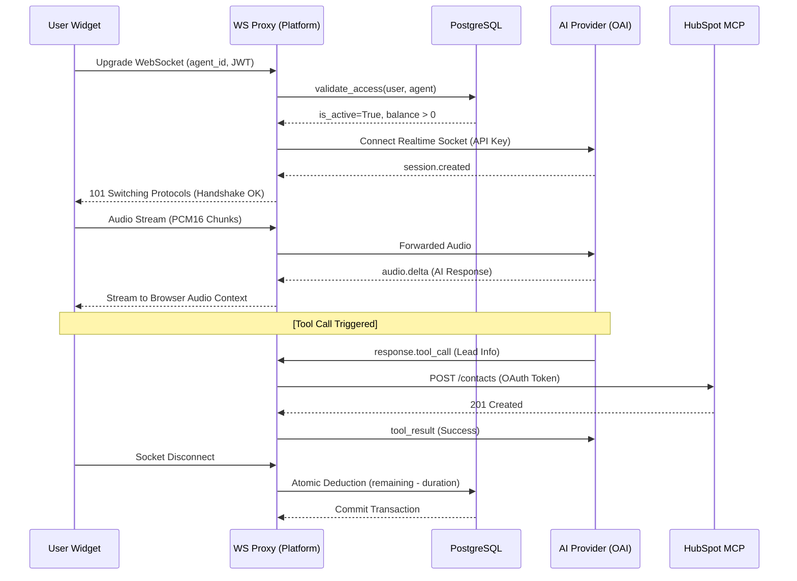

# 06 | Proxy Layer & Telephony
**Subject**: WebSocket Orchestration, Real-time Audio Pipelines, and Provider Bridging  
**Version**: 1.5.0  

---

## 📑 Table of Contents
1. [The Real-time Proxy Challenge](#the-real-time-proxy-challenge)
2. [Stateful WebSocket Pipeline Architecture](#stateful-websocket-pipeline-architecture)
3. [Audio Protocol & Streaming Specifications](#audio-protocol--streaming-specifications)
4. [Intelligent VAD (Voice Activity Detection)](#intelligent-vad-voice-activity-detection)
5. [Real-time Usage Metering & Guardrails](#real-time-usage-metering--guardrails)
6. [Provider Bridge: AI Orchestration](#provider-bridge-ai-orchestration)

---

## 1. The Real-time Proxy Challenge
The technical core of the platform is the **WebSocket Proxy**. Unlike standard RESTful interactions, voice requires a bidirectional, sub-100ms persistent tunnel that bridges a client's audio buffer to a remote AI processor. The proxy acts as a "Man-in-the-Middle" that performs auth validation, duration metering, and audio transcoding in real-time.

### 1.1 Voice Session Sequence Diagram

---

## 2. Stateful WebSocket Pipeline Architecture
The pipeline (implemented in `widget.py`) manages a complex state machine for every concurrent session.

### 2.1 The Inbound Loop (Client -> Proxy -> AI)
*   **Encapsulation**: Receives Base64-encoded PCM16 chunks from the widget.
*   **Validation**: Every connection undergoes a domain-origin check (`validate_domain`) to prevent unauthorized widget embedding (Hotlinking).
*   **Gating**: The proxy performs a synchronous check on the `Agent.is_active` flag. If the user's wallet is empty, the WebSocket is immediately terminated with an `insufficient_balance` error frame.

### 2.2 The Outbound Loop (AI -> Proxy -> Client)
*   **Delta Forwarding**: Audio deltas from the AI provider are streamed to the client immediately to ensure zero-latency response perception.
*   **Event Interception**: The proxy listens for `response.audio_transcript.done` to update the interaction log and `input_audio_buffer.speech_started` to handle user interruptions gracefully.

---

## 3. Audio Protocol & Streaming Specifications
The platform enforces a strict audio standard to maintain compatibility with the AI provider's Realtime models.

### 3.1 Transcoding Specs
*   **Codec**: Raw PCM16 (Uncompressed 16-bit Signed).
*   **Sample Rate**: **24,000 Hz** (Downsampled if necessary, as high-fidelity 48kHz is redundant for voice recognition).
*   **Bitrate**: 384kbps mono.
*   **Format**: Sent as raw binary or Base64 JSON envelopes depending on the transport phase.

---

## 4. Intelligent VAD (Voice Activity Detection)
The proxy abstracts the complexity of turn-taking through server-side VAD.

### 4.1 "Formation" Settings
Each agent can be tuned via the `Agent` model for specific environments:
*   **Near Field**: Optimized for handheld or headset usage (Sensitivity: 0.5-0.7).
*   **Far Field**: Optimized for room-scale interactions (Sensitivity: 0.3-0.5).
*   **Prefix Padding**: Stored as `noise_reduction_prefix_padding_ms`, ensuring the AI doesn't clip the first syllable of user speech.
*   **Silence Timeout**: Controlled by `noise_reduction_silence_duration_ms` (Default 500ms) before the AI triggers its response generation.

---

## 5. Real-time Usage Metering & Guardrails
Billing is handled at the source of the stream to ensure financial integrity.

### 5.1 The Ledger Handshake
1.  **Session Start**: `started_at` is marked the moment the AI provider socket reaches an `OPEN` state.
2.  **Token Accumulation**: The proxy captures `usage` blocks from `response.done` events, accumulating `audio_input_tokens`, `audio_output_tokens`, and text counterparts into the `websocket_usage` dictionary.
3.  **Atomic Exit**: On `WebSocketDisconnect`, the `update_tokens()` method calculates the final USD cost based on token counts + a system-wide markup, and decrements the user's `remaining_seconds` in an atomic SQL transaction.

---

## 6. Provider Bridge: AI Orchestration
The proxy handles the "Last Mile" security and configuration injection.

### 6.1 Instruction Injection & MCP (Model Context Protocol)
Upon connection, the proxy constructs a "Master Prompt" for the AI:
*   **Dynamic Instructions**: Injects the `Agent.instructions`.
*   **Startup Commands**: If `startup_message` is configured, the proxy injects a `session.update` command forcing the AI to speak the greeting first.
*   **HubSpot MCP (Lead Management)**: 
    *   **Protocol**: The system implements the **Model Context Protocol (MCP)** to expose external CRM capabilities to the AI.
    *   **Orchestration**: If `enable_mcp_server` is toggled, the proxy injects a set of "Fixed CRM Instructions" (Lead capture for Name, Email, Phone, Company).
    *   **Tool-Calling**: The AI provider recognizes these as functions. When the AI "calls" a tool, the Proxy intercepts the JSON frame, retrieves the stored HubSpot OAuth token via `IntegrationConfigService`, and executes an asynchronous POST request to the HubSpot `/crm/v3/objects/contacts` endpoint.
    *   **Silent Lead Generation**: This happens during the live call, allowing the agent to confirm "I've saved your details for a callback" in real-time.

---
**END OF SECTION 06**
