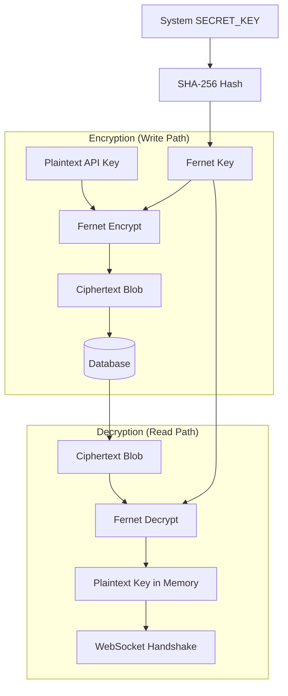

# 07 | Security Standards
**Subject**: JWT Orchestration, AES-256 Encryption, and Access Control Paradigms  
**Version**: 1.5.0  

---

## 📑 Table of Contents
1. [The Security Perimeter](#the-security-perimeter)
2. [Identity & Tokenization (JWT)](#identity--tokenization-jwt)
3. [Field-Level Data Encryption](#field-level-data-encryption)
4. [Role-Based Access Control (RBAC)](#role-based-access-control-rbac)
5. [CORS & Domain Gating](#cors--domain-gating)
6. [Secure Credential Lifecycle](#secure-credential-lifecycle)

---

## 1. The Security Perimeter
The platform implements a "Defense-in-Depth" strategy, ensuring that visual access (Dashboard), API management, and real-time voice bridges are isolated and secured via independent protocols.

---

## 2. Identity & Tokenization (JWT)
User sessions are stateless, managed via **JSON Web Tokens (JWT)**.

### 2.1 Token Lifecycle
*   **Algorithm**: HMAC-SHA256 (`HS256`).
*   **Expiration**: Configured via `ACCESS_TOKEN_EXPIRE_MINUTES` (Default: 30m) to minimize the impact of token theft.
*   **Claims**: Stores the `user_id` as the `sub` (Subject descriptor).
*   **Verification**: The `decode_access_token` utility validates the signature and timestamp before every management action.

### 2.2 Password Security
The system uses **Bcrypt** for hashing but with a specialized enhancement to bypass the 72-byte limit:
1.  The plain-text password is first hashed with **SHA-256**.
2.  The resulting 64-byte hex string is then salted and hashed with **Bcrypt**.
3.  This allows users to use enterprise-length passphrases without security degradation.

---

## 3. Field-Level Data Encryption
Sensitive external secrets (e.g., OpenAI API Keys, HubSpot OAuth Tokens) are never stored in plain text.

### 3.1 Encryption Mechanism (`encryption.py`)
The system utilizes **Fernet (Symmetric Encryption)**-derived keys:

#### 3.2 Secure Data Lifecycle

*   **Base Secret**: Derived from the system `SECRET_KEY` via `hashlib.sha256`.
*   **Format**: `Fernet(base64_url_safe_secret)`.
*   **Persistence**: Encrypted blobs are stored in the `service_account_key` and `integration_config` tables.
*   **Runtime**: Keys are only decrypted in-memory by the `decrypt_api_key` utility during the sub-second window of a WebSocket handshake.

---

## 4. Role-Based Access Control (RBAC)
Access to endpoints is governed by Pydantic-driven role assertions.

### 4.1 Role Tiers
*   **User (`USER`)**: Restrictive access to owned agents, personal billing, and usage charts.
*   **SuperAdmin (`SUPERADMIN`)**: Broad access including user management, global COGS monitoring, and the ability to send platform-wide expense reports.
*   **Logic**: Enforced via the `require_active_subscription` dependency, which performs a dual-check for `PaymentStatus.SUCCESS` and `Subscription.end_date >= now`.

---

## 5. CORS & Domain Gating
The platform implements strict Cross-Origin Resource Sharing (CORS) policies to prevent cross-site request forgery (CSRF) and unauthorized widget usage.

### 5.1 Gating Rules
*   **API Gating**: Only authorized subdomains (e.g., `app.voicequik.com`) can connect to the management routers.
*   **WebSocket Gating**: The proxy performs a strict `validate_domain` check against the `Agent.domain` field. If a widget is embedded on an unauthorized URL, the connection is rejected before any audio frames are processed.

---

## 6. Secure Credential Lifecycle (OAI & HubSpot)
For advanced integrations like **HubSpot CRM**, the system manages a tiered token lifecycle.

### 6.1 HubSpot OAuth 2.0 Flow
1.  **Authorization**: The user initiates a "Connect HubSpot" request from the Dashboard, redirecting to the HubSpot consent screen.
2.  **Code Exchange**: Upon approval, HubSpot redirects back to our API with an `authorization_code`.
3.  **Encrypted Sink**: The backend exchanges this for an `access_token` and `refresh_token`, which are immediately encrypted using **AES-256 (Fernet)** before storage in `IntegrationConfig`.
4.  **Automatic Rotation**: The `refresh_hubspot_oauth_token` service automatically detects token expiration (within a 5-minute window) and performs a silent refresh using stored encrypted secrets.
5.  **Access Revocation**: Deactivating the integration triggers an atomic deletion of the ciphertext from the database, ensuring zero-access persistence.

---
**END OF SECTION 07**
